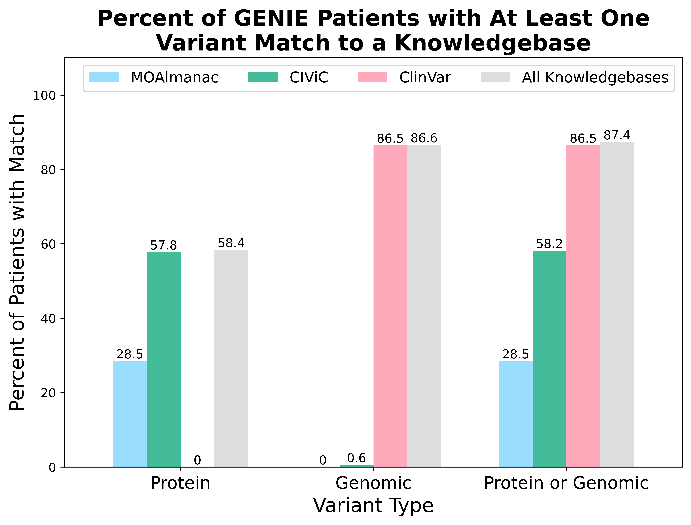

# Variation Normalizer Manuscript

This repo contains analysis notebooks used in the _The Clinical Genomic Variation Landscape_ manuscript.

Small output files can be found in this repo. Larger files can be found in our public s3 bucket: `s3://nch-igm-wagner-lab-public/variation-normalizer-manuscript/2025`. There are notebooks that provide functions for programmatically downloading files from the s3 bucket.

After running the notebooks, users will be able to create figures such as these that demonstrate the results of the analysis, such as the below figure.

Variant normalization allows patient data from AACR Project GENIE to be matched to normalized variants in the CIViC, MOAlmanac, and ClinVar knowledgebases.



## Set Up

Before running the notebooks, you must set up your environment.

### Prerequisites

* [Docker](https://docs.docker.com/get-started/get-docker/)
* Python 3.13
  * We recommend using [uv](https://github.com/astral-sh/uv) to install.
* libpq
* postgresql

#### MacOS

You can use Homebrew to install the prerequisites. See the
[Homebrew documentation](https://docs.brew.sh/Installation) for how to install.
Make sure Homebrew is up-to-date by running `brew update`.

```shell
brew install libpq
brew install postgresql@14
```

#### Ubuntu

```shell
sudo apt install gcc libpq-dev python3-dev
```

### Creating the virtual environment

#### uv

From the root directory, run the following to create the venv and install exact packages:

```shell
uv python pin 3.13
uv venv
source .venv/bin/activate
uv sync --all-extras
git submodule update --init --recursive
```

#### pip

```shell
python3 -m venv .venv
source .venv/bin/activate
python3 -m pip install -r requirements.txt
git submodule update --init --recursive
```

### Environment Variables

We use [python-dotenv](https://pypi.org/project/python-dotenv/) to load environment variables needed for analysis notebooks that run the [Variation Normalizer](https://github.com/cancervariants/variation-normalization/tree/0.6.0-dev0).

If you are running any of the following notebooks, this section is required:

* [analysis/civic/variation_analysis/civic_variation_analysis.ipynb](./analysis/civic/variation_analysis/civic_variation_analysis.ipynb)
* [analysis/cnvs/parse_prep_normalize_nch_cnvs.ipynb](./analysis/cnvs/parse_prep_normalize_nch_cnvs.ipynb)
* [analysis/genie/pre_variant_analysis/genie_pre_variant_analysis.ipynb](./analysis/genie/pre_variant_analysis/genie_pre_variant_analysis.ipynb)
* [analysis/moa/feature_analysis/moa_feature_analysis.ipynb](./analysis/moa/feature_analysis/moa_feature_analysis.ipynb)

In the analysis notebooks, you will see:

```python
from dotenv import load_dotenv

load_dotenv()
```

This will load environment variables from the `.env` file in the root directory. You will need to create this file yourself. The structure will look like:

```markdown
.
├── analysis
├── .env
└── README.md
```

The environment variables that will need to be set inside the `.env` file:

```env
SEQREPO_ROOT_DIR=/usr/local/share/seqrepo/2024-12-20
```

### Set Up Backend Services

This analysis relies on backend services, which you must set up yourself.

#### 1. Biocommons SeqRepo

[Biocommons SeqRepo](https://github.com/biocommons/biocommons.seqrepo) is used for fast access to sequence data. This analysis uses [2024-12-20](https://dl.biocommons.org/seqrepo/2024-12-20/) SeqRepo data.

Follow the [Quick Start Documentation](https://github.com/biocommons/biocommons.seqrepo/tree/0.6.11?tab=readme-ov-file#quick-start)
for setting up SeqRepo (2024-12-20).

##### SeqRepo Verification

To verify, run the following inside your virtual environment:

```shell
╰─$ python3
Python 3.13.1 (main, Dec 31 2024, 13:03:34) [Clang 16.0.0 (clang-1600.0.26.6)] on darwin
Type "help", "copyright", "credits" or "license" for more information.
>>> from biocommons.seqrepo import SeqRepo
>>> sr = SeqRepo(root_dir="/usr/local/share/seqrepo/2024-12-20")
>>> sr["NC_000001.11"][780000:780020]
'TGGTGGCACGCGCTTGTAGT'
```

##### SeqRepo Issues

If you have trouble using the default path, try creating a symlink, by running the following:

```shell
seqrepo update-latest
```

Verify that this works in [SeqRepo Verification](#seqrepo-verification).

#### 2. Variation Normalizer: Docker Container

To build, (re)create, and start containers

```shell
docker volume create --name=uta_vol
docker compose \
  -p variation-normalizer-manuscript \
  -f submodules/compose.yaml \
  -f compose.yaml \
  up
```

> [!IMPORTANT]
> This assumes you have a local [SeqRepo](https://github.com/biocommons/biocommons.seqrepo)
installed at `/usr/local/share/seqrepo/2024-12-20`. If you have it installed elsewhere,
please update add a `SEQREPO_ROOT_DIR` environment variable in
[compose.yaml](./compose.yaml).\
> If you're using Docker Desktop, you'll want to go to Settings -> Resources -> File sharing
and add `/usr/local/share/seqrepo` under the `Virtual file shares` section. Otherwise,
you will get the following error:
`OSError: Unable to open SeqRepo directory /usr/local/share/seqrepo/2024-12-20`.

> [!TIP]
> If you want a clean slate, run `docker compose down -v` to remove containers and
> volumes, then `docker compose -p variation-normalizer-manuscript -f submodules/compose.yaml -f compose.yaml up` to rebuild and start fresh containers.

## Running Notebooks

This section provides information about the notebooks and the order that they should be run in.

1. Run the following notebook:
    * [analysis/download_s3_files.ipynb](./analysis/download_s3_files.ipynb)
      * Downloads files from public s3 bucket that are needed for the notebooks.
        * Downloads ClinVar CNV, MANE Ensembl GFF, and NCH CNV data
          * The following notebooks were used to create the files that are downloaded in this notebook (order does not matter):
            * [analysis/cnvs/prep_clinvar_cnvs.ipynb](./analysis/cnvs/prep_clinvar_cnvs.ipynb)
              * Creates `ClinVar-CNVs-normalized.csv`
            * [analysis/cnvs/parse_prep_normalize_nch_cnvs.ipynb](./analysis/cnvs/parse_prep_normalize_nch_cnvs.ipynb)
              * Creates `NCH-microarray-CNVs-cleaned.csv`
2. Run the following notebooks (order does not matter):
   * [analysis/civic/variation_analysis/civic_variation_analysis.ipynb](./analysis/civic/variation_analysis/civic_variation_analysis.ipynb)
     * Runs CIViC variant data through the Variation Normalizer
   * [analysis/clinvar/clinvar_variation_analysis.ipynb](./analysis/clinvar/clinvar_variation_analysis.ipynb)
     * Analysis on ClinVar variant data
   * [analysis/genie/pre_variant_analysis/genie_pre_variant_analysis.ipynb](./analysis/genie/pre_variant_analysis/genie_pre_variant_analysis.ipynb)
     * Runs GENIE variant data through the Variation Normalizer
   * [analysis/moa/feature_analysis/moa_feature_analysis.ipynb](./analysis/moa/feature_analysis/moa_feature_analysis.ipynb)
     * Runs MOA feature data through the Variation Normalizer

  > [!IMPORTANT]
  > You must have the [Docker containers](#2-variation-normalizer-docker-container)
  > running for these notebooks.

3. Run the following notebooks (order does not matter):
    * [analysis/civic/variation_analysis/transcript_variation_analysis.ipynb](./analysis/civic/variation_analysis/transcript_variation_analysis.ipynb)
      * Analysis on CIViC variants in the Transcript category
    * [analysis/civic/evidence_analysis/civic_evidence_analysis.ipynb](./analysis/civic/evidence_analysis/civic_evidence_analysis.ipynb)
      * Analysis on CIViC evidence items
    * [analysis/cnvs/query_match_nch_clinvar_cnvs.ipynb](./analysis/cnvs/query_match_nch_clinvar_cnvs.ipynb)
      * Analysis on feature overlap in NCH and ClinVar CNVs
    * [analysis/genie/variant_analysis/genie_search_analysis.ipynb](./analysis/genie/variant_analysis/genie_search_analysis.ipynb)
      * Analysis on matched normalized GENIE variants and normalized variants from CIViC, MOA, and ClinVar
    * [analysis/moa/assertion_analysis/moa_assertion_analysis.ipynb](./analysis/moa/assertion_analysis/moa_assertion_analysis.ipynb)
      * Analysis on MOA assertions
4. Run the following notebook:
    * [analysis/merged_moa_civic/merged_moa_civic_evidence_analysis.ipynb](./analysis/merged_moa_civic/merged_moa_civic_evidence_analysis.ipynb)
      * Combined analysis on CIViC evidence items and MOA assertions
5. Run the following notebook:
    * [analysis/performance_analysis/merged_performance_analysis.ipynb](./analysis/performance_analysis/merged_performance_analysis.ipynb)
      * Analysis on Variation Normalizer performance on CIViC, MOA, and ClinVar

### Running Notebooks in Visual Studio Code (VS Code)

[VS Code](https://code.visualstudio.com/) is a lightweight source code editor for Windows, Linux, and macOS.

1. Download VS Code [here](https://code.visualstudio.com/Download)
2. Open a notebook and click `Select Kernel` at the top right. Select the option where the path is `venv/3.13/bin/python`. See [here](https://code.visualstudio.com/docs/datascience/jupyter-kernel-management) for more information on managing Jupyter Kernels in VS Code.
3. Run the notebooks

## Analysis with macOS Environments

These notebooks were run using these macOS specs:

| Model Year | CPU Architecture | Total RAM | Hard drive capacity |
| --- | --- | --- | --- |
| 2019 | 2.6 GHz 6-Core Intel Core i7 | 32 GB | 1 TB |
| 2021 | M1 Pro | 32 GB | 1 TB |

## Help

If you have any questions or problems, please [make an issue](https://github.com/GenomicMedLab/variation-normalizer-manuscript/issues/new) in the repo and our team will be happy to assist.
