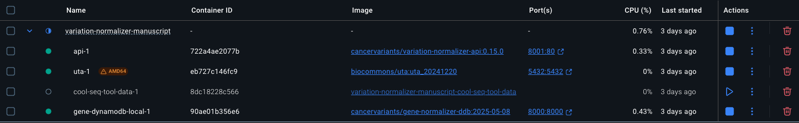

# Variation Normalizer Manuscript

This repo contains analysis notebooks used in the _The Clinical Genomic Variation Landscape_ manuscript.

Small output files can be found in this repo. Larger files can be found in our public
s3 bucket: `s3://nch-igm-wagner-lab-public/variation-normalizer-manuscript/2025`. There
are notebooks that provide functions for programmatically downloading files from the s3
bucket.

After running the notebooks, users will be able to create figures that demonstrate the
results of the analysis, such as the below figure.

Variant normalization allows patient samples from AACR Project GENIE to be matched to
normalized variants in the CIViC, MOAlmanac, and ClinVar knowledgebases.


## Set Up

Before running the notebooks, you must set up your environment.

### Prerequisites

* [Docker](https://docs.docker.com/get-started/get-docker/)
* Python 3.13
  * We recommend using [uv](https://github.com/astral-sh/uv) to install.
* libpq
* postgresql

#### MacOS

You can use Homebrew to install the prerequisites. See the
[Homebrew documentation](https://docs.brew.sh/Installation) for how to install.
Make sure Homebrew is up-to-date by running `brew update`.

```shell
brew install libpq
brew install postgresql@14
```

#### Ubuntu

```shell
sudo apt install gcc libpq-dev python3-dev
```

### Creating the virtual environment

#### uv

From the root directory, run the following to create the venv and install exact packages:

```shell
uv python pin 3.13
uv venv
source .venv/bin/activate
uv sync --all-extras
git submodule update --init --recursive
```

#### pip

```shell
python3.13 -m venv .venv
source .venv/bin/activate
python3.13 -m pip install -r requirements.txt
git submodule update --init --recursive
```

### Set Up Backend Services

This analysis relies on backend services, which you must set up yourself:

1. [Biocommons SeqRepo](#1-biocommons-seqrepo)
2. [Variation Normalizer: Docker Container](#2-variation-normalizer-docker-container)

#### 1. Biocommons SeqRepo

[Biocommons SeqRepo](https://github.com/biocommons/biocommons.seqrepo) is used for fast
access to sequence data. This analysis uses
[2024-12-20](https://dl.biocommons.org/seqrepo/2024-12-20/) SeqRepo data.

Follow the [Quick Start Documentation](https://github.com/biocommons/biocommons.seqrepo/tree/0.6.11?tab=readme-ov-file#quick-start)
for setting up SeqRepo (2024-12-20).

##### SeqRepo Verification

To verify, run the following inside your virtual environment:

```shell
╰─$ python3
Python 3.13.1 (main, Dec 31 2024, 13:03:34) [Clang 16.0.0 (clang-1600.0.26.6)] on darwin
Type "help", "copyright", "credits" or "license" for more information.
>>> from biocommons.seqrepo import SeqRepo
>>> sr = SeqRepo(root_dir="/usr/local/share/seqrepo/2024-12-20")
>>> sr["NC_000001.11"][780000:780020]
'TGGTGGCACGCGCTTGTAGT'
```

##### Troubleshooting SeqRepo

* Ensure you have the correct `rsync` executable: GNU rsync, NOT openrsync.
Recent MacOS releases include the latter and not the former, but it can be installed
with `homebrew` and provided to SeqRepo a la
`seqrepo --rsync-exe $(brew --prefix)/bin/rsync`.
* If you encounter a permission error like this:

  ```shell
  PermissionError: [Error 13] Permission denied: '/usr/local/share/seqrepo/2024-02-20._fkuefgd' -> '/usr/local/share/seqrepo/2024-02-20'
  ```

Try moving data manually with `sudo`:

```shell
sudo mv /usr/local/share/seqrepo/$SEQREPO_VERSION.* /usr/local/share/seqrepo/$SEQREPO_VERSION
```

#### 2. Variation Normalizer: Docker Container

> [!IMPORTANT]
> This section assumes you have a local [SeqRepo](https://github.com/biocommons/biocommons.seqrepo)
installed at `/usr/local/share/seqrepo/2024-12-20`. If you have it installed elsewhere,
please update add a `SEQREPO_ROOT_DIR` environment variable in
[compose.yaml](./compose.yaml) and [.env.shared](./.env.shared).\
> If you're using Docker Desktop, you must go to Settings -> Resources -> File sharing
and add `/usr/local/share/seqrepo` under the `Virtual file shares` section. Otherwise,
you will get the following error:
`OSError: Unable to open SeqRepo directory /usr/local/share/seqrepo/2024-12-20`.

To build, (re)create, and start containers

```shell
docker volume create --name=uta_vol
docker compose \
  -p variation-normalizer-manuscript \
  -f submodules/compose.yaml \
  -f compose.yaml \
  up
```

> [!TIP]
> If you want a clean slate, run `docker compose down -v` to remove containers and
> volumes, then `docker compose -p variation-normalizer-manuscript -f submodules/compose.yaml -f compose.yaml up` to rebuild and start fresh containers.

> [!NOTE]
> We use [python-dotenv](https://pypi.org/project/python-dotenv/) to load environment
> variables needed for analysis notebooks that run the
[Variation Normalizer](https://github.com/cancervariants/variation-normalization/tree/0.15.0).
> Environment variables can be located at [.env.shared](./.env.shared).

In Docker Desktop, you should see the following for a successful setup:



`cool-seq-tool-data-1` exits after download it is complete. The other three images
(`api-1`, `uta-1`, and `gene-dynamodb-local-1`) should all be running.

## Running Notebooks

This section provides information about the notebooks and the order that they should be run in.
The Table of Contents, in the notebooks that have them, will link to the sections in the notebooks. 
You must use VS Code in order for Table of Contents to work. See section below.

> [!IMPORTANT]
> You must have the [Docker containers](#2-variation-normalizer-docker-container) running.

1. Run the following notebook:
    * [analysis/download_s3_files.ipynb](./analysis/download_s3_files.ipynb)
      * Downloads ClinVar CNV and NCH CNV from public s3 bucket that are needed for the notebooks.
        * The following notebooks were used to create the files that are downloaded in
        this notebook. You do not need to re-run these notebooks. Order does not matter
        if you do choose to re-run:
          * [analysis/cnvs/prep_clinvar_cnvs.ipynb](./analysis/cnvs/prep_clinvar_cnvs.ipynb)
            * Creates `ClinVar-CNVs-normalized.csv` and `NCH-normalizer-results.json`
          * [analysis/cnvs/parse_prep_normalize_nch_cnvs.ipynb](./analysis/cnvs/parse_prep_normalize_nch_cnvs.ipynb)
            * Creates `NCH-microarray-CNVs-cleaned.csv`
2. Run the following notebooks (order does not matter):
   * [analysis/civic/variation_analysis/civic_variation_analysis.ipynb](./analysis/civic/variation_analysis/civic_variation_analysis.ipynb)
     * Runs CIViC variant data through the Variation Normalizer
   * [analysis/clinvar/clinvar_variation_analysis.ipynb](./analysis/clinvar/clinvar_variation_analysis.ipynb)
     * Analysis on ClinVar variant data
   * [analysis/genie/pre_variant_analysis/genie_pre_variant_analysis.ipynb](./analysis/genie/pre_variant_analysis/genie_pre_variant_analysis.ipynb)
     * Runs GENIE variant data through the Variation Normalizer
   * [analysis/moa/feature_analysis/moa_feature_analysis.ipynb](./analysis/moa/feature_analysis/moa_feature_analysis.ipynb)
     * Runs MOA feature data through the Variation Normalizer
3. Run the following notebooks (order does not matter):
    * [analysis/civic/variation_analysis/transcript_variation_analysis.ipynb](./analysis/civic/variation_analysis/transcript_variation_analysis.ipynb)
      * Analysis on CIViC variants in the Transcript category
    * [analysis/civic/evidence_analysis/civic_evidence_analysis.ipynb](./analysis/civic/evidence_analysis/civic_evidence_analysis.ipynb)
      * Analysis on CIViC evidence items
    * [analysis/cnvs/query_match_nch_clinvar_cnvs.ipynb](./analysis/cnvs/query_match_nch_clinvar_cnvs.ipynb)
      * Analysis on feature overlap in NCH and ClinVar CNVs
    * [analysis/genie/variant_analysis/genie_search_analysis.ipynb](./analysis/genie/variant_analysis/genie_search_analysis.ipynb)
      * Analysis on matched normalized GENIE variants and normalized variants from CIViC, MOA, and ClinVar
    * [analysis/moa/assertion_analysis/moa_assertion_analysis.ipynb](./analysis/moa/assertion_analysis/moa_assertion_analysis.ipynb)
      * Analysis on MOA assertions
4. Run the following notebook:
    * [analysis/merged_moa_civic/merged_moa_civic_evidence_analysis.ipynb](./analysis/merged_moa_civic/merged_moa_civic_evidence_analysis.ipynb)
      * Combined analysis on CIViC evidence items and MOA assertions
5. Run the following notebook:
    * [analysis/performance_analysis/merged_performance_analysis.ipynb](./analysis/performance_analysis/merged_performance_analysis.ipynb)
      * Analysis on Variation Normalizer performance on CIViC, MOA, and ClinVar

### Running Notebooks in Visual Studio Code (VS Code)

[VS Code](https://code.visualstudio.com/) is a lightweight source code editor for Windows, Linux, and macOS.

1. [Download VS Code](https://code.visualstudio.com/Download)
2. Open a notebook and click `Select Kernel` at the top right. Select the option where
the path is `.venv/3.13/bin/python` or `.venv/bin/python`. See
[Manage Jupyter Kernels in VS Code](https://code.visualstudio.com/docs/datascience/jupyter-kernel-management)
for more information on managing Jupyter Kernels in VS Code.
3. Run the notebooks

## Analysis with macOS Environments

These notebooks were run using these macOS specs:

| Model Year | CPU Architecture | Total RAM | Hard drive capacity |
| --- | --- | --- | --- |
| 2023 | M2 Pro | 32 GB | 1 TB |
| 2023 | M3 Pro | 36 GB | 1 TB |
| 2024 | M4 Pro | 48 GB | 1 TB |

## Help

If you have any questions or problems, please [make an issue](https://github.com/GenomicMedLab/variation-normalizer-manuscript/issues/new)
in the repo and our team will be happy to assist.
